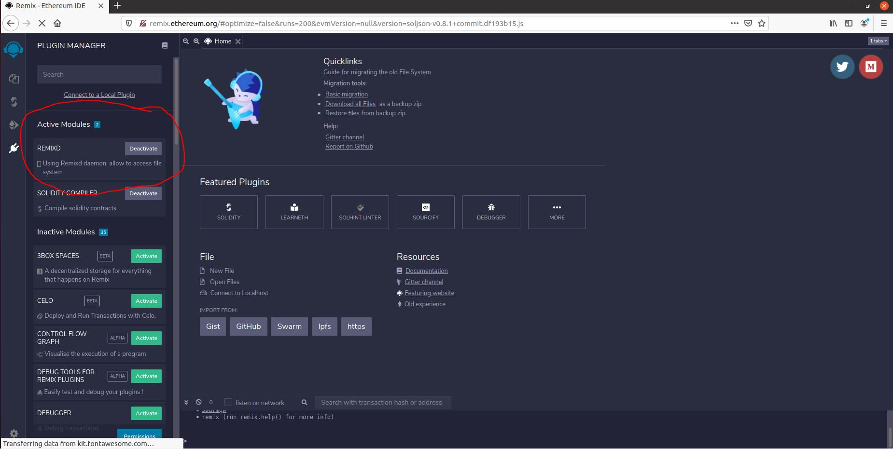
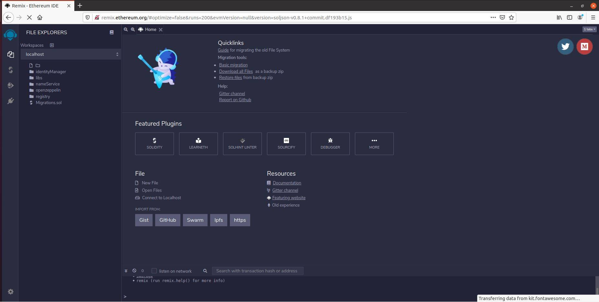

# Alastria Hardhat Project

## Utilities

```
npx hardhat help
npx hardhat test
REPORT_GAS=true npx hardhat test
npx hardhat node
npx hardhat run scripts/deploy.js
```

## **What is does?**

Smart Contracts are the key point to work with the Alastria Identity Ecosystem. Without this part the whole ecosystem will not work, so it is very important to be sure that this repository is installed and the Smart Contracts are deployed properly on the blockchain.

## Smart Contracts

All contracts which are placed here are the following ones:

### 1.- IdentityManager

| Contract                            | What it does                                                                                                                                      |
| :---------------------------------- | :------------------------------------------------------------------------------------------------------------------------------------------------ |
| AlastriaIdentityManager.sol         | It generates access tokens, creates identities, deploys an AlastriaProxy for each identity and sends transactions through the proxy of the sender |
| AlastriaProxy.sol                   | It is the Alastria ID itself. Only receives transactions from the IdentityManager and resends them to the target                                  |
| AlastriaIdentityIssuer.sol          | It keeps a registry of the issuers identities                                                                                                     |
| AlastriaIdentityServiceProvider.sol | It keeps a registry of the service providers identities                                                                                           |
| AlastriaIdentityEntity.sol          | It keeps a registry of the entities                                                                                                               |

### 2.- Registry

| Contract                         | What it does                                                           |
| :------------------------------- | :--------------------------------------------------------------------- |
| AlastriaCredentialRegistry.sol   | It manages all the credentials and keeps the registry and the status   |
| AlastriaPresentationRegistry.sol | It manages all the presentations and keeps the registry and the status |
| AlastriaPublicKeyRegistry.sol    | It manages all the public keys and keeps the registry                  |

### 3.- Libs

The previous contracts use some libraries which are:

| Contract  | What it does                                        |
| :-------- | :-------------------------------------------------- |
| Eidas.sol | It manages Eidas level of assurance for credentials |

### 4.- Access

The previous contracts use this access management:

| Contract    | What it does                                                                      |
| :---------- | :-------------------------------------------------------------------------------- |
| Ownable.sol | It assures that just the account which deployed a contract can update the version |

### 5.- openzeppelin

These instances of Open Zeppelin contracts have been tailored for the Alastria v2.2 project.

| Contract                         | What it does                                                                          |
| :------------------------------- | :------------------------------------------------------------------------------------ |
| Initializable.sol                | Used for marking a contract as initializable in the upgradeable framework             |
| AdminUpgradeabilityProxy.sol     | IS the inherit contract for making Alastria contracts upgradeables                    |
| BaseAdminUpgradeabilityProxy.sol | Generates an admin proxy, avoiding admin account calling implementation               |
| BaseUpgradeabilityProxy.sol      | Generates an upgradeable contract based in UpgradeabilityProxy fallback               |
| Proxy.sol                        | Is the base contract for upgradeability, generating a fallback pattern                |
| UpgradeabilityProxy.sol          | Expands basic proxy to create a proxy that accepts upgradeability (memory management) |

## Deploy Contracts

In this section it will be possible to see how to work with Smart Contracts in different environments which are: Remix, Ganache + Truffle and in a test environment. It will be explained for cases where you want to use your own scripts and in case you want to use the scripts you can find in the `package.json` file

### Own Scripts

#### Remix

To work with remix, you can install it globally, with the following command:
`npm i -g @remix-project/remixd` doing this you have remixd installed.
Also, remix is included in the repo, you can go with the install of the project and use:
`npm run remixd`
Once it is done the previous step, in your browser you have to type remix.ethereum.org and you have to connect the Remixd plugin



Done this step, you have to verify if in your console appears remix logs like this ones

```
[WARN] You can only connect to remixd from one of the supported origins.
[WARN] Any application that runs on your computer can potentially read from and write to all files in the directory.
[WARN] Symbolic links are not forwarded to Remix IDE

Wed Jun 02 2021 16:29:18 GMT+0200 (GMT+02:00) remixd is listening on 127.0.0.1:65520
[WARN] You may now only use IDE at http://remix.ethereum.org to connect to that instance
setup notifications for /home/ubuntu/Escritorio/temp-alastriaID-truffle-contracts/contracts/
```

As well of you click on the first icon where the smart contracts are, they will appear on this tab.


Then you can work with the Smart Contracts, deploying firstly AlastriaIdentityManager

### Repository Scripts

This repository has in `package.json` some scripts which are very useful in case you don't want to loose time installing things, but it is important to have installed docker in your system.

To install all content from `package.json`, inside the repo, just run `npm i` , once it is executed you can run the following scripts through npm run command:

- **test**: To run the unittest for the Smart Contracts
- **coverage**:To run the script coverage-verify which checks the coverage of the Smart Contracts
- **compile**: To compole the Smart Contracts
- **migrateToRedT** : To run deploy and initialize in T network. Consisting on:
  1. `scripts/deploy.js` Which deploy and initialize the contracts in red-t, storing the addresses of the Smart Contracts on file `addresses.json`
- **updateRedT**: To make upgradeables Smart Contracts from T network. For this, it is used the migration called `scripts/update.js`
- **migrateToRedB**: To run deploy and initialize in Besu network. Consisting on:
  1. `scripts/deploy.js` Which deploy and initialize the contracts in red-b, storing the addresses of the Smart Contracts on file `addresses.json`
- **updateRedB**: To make upgradeables Smart Contracts from B network. For this, it is used the migration called `scripts/update.js`
- **migrateToLocal**: To run deploy and initialize in Local network. Consisting on:
  1. `scripts/deploy.js` Which deploy and initialize the contracts in red-b, storing the addresses of the Smart Contracts on file `addresses.json`
- **updateLocal**: To make upgradeables Smart Contracts from local network. For this, it is used the migration called `scripts/update.js`
- **lint**: Linter to identify and fix Style & Security issues in Solidity
- **remixd**: To run remixd and run contracts in Remix
- **dockerTestnetRun**: Run docker with ethereum node in port 8545
- **dockerTestnetStop**: Stop and remove docker with ethereum node
- **dockerTestnerLogs**: Get logs from docker with ethereum node
- **dockerTestnetConsole**: Go inside docker to make an attachment and work with geth console.

### Configurations

In order to run the project in different types of Network, there are some configurations to take into account. There are the following ones:

- **Node in T Network has the following IP address**: **http://redT-nodeIP**
- **Node in B Network has the following IP address**: **http://redB-nodeIP**

Once it is know the previous aspects, in the truffle-config file there are some possibilities to deploy the Smart Contracts which are the next ones:

- **local**: Which work with the local network and the admin and first-id acounts
- **red-t**: Which works with the t-network node and the admin and first-id acounts
- **red-b**: Which works with the b-network node and the admin and first-id acounts

Both accounts are the following ones:

- **firstIdentityWallet**: `0x643266eb3105f4bf8b4f4fec50886e453f0da9ad`
- **adminAccount**: `0x6e3976aeaa3A59E4AF51783CC46EE0fFabC5DC11`  
  _Their respective private keys are stored in the accounts folder_

### Contribution

**Contribution made by Inetum during 2024 in this document has received funding from the European Union's Horizon 2020 research and innovation programme under grant agreement No. 101084071. (Dome project https://dome-marketplace.eu/)**
